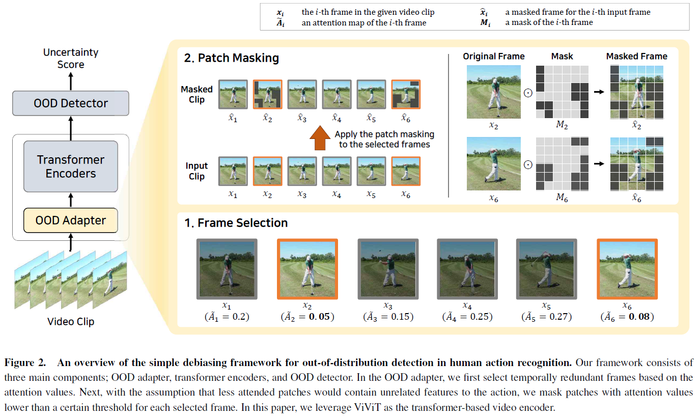

# A Simple Debiasing Framework for Out-of-Distribution Detection in Human Action Recognition (ECAI2023)

["A Simple Debiasing Framework for Out-of-Distribution Detection in Human Action Recognition"](https://ecai2023.eu/acceptedpapers). ECAI2023.\
Minho Sim, Young-Jun Lee, Donkun Lee, Jongwhoa Lee, and Ho-Jin Choi\
Korea Advanced Institute of Science and Technology, Daejeon, South Korea


## Overview


## Dependencies

Install dependencies:

```
pip install -r requirements.txt
```

Setup project:

```
pip install .
```

## Results

case study


## Citation

If you find this repository useful, please consider citing:

```
@article{sim2023simple,
  title={A Simple Debiasing Framework for Out-of-Distribution Detection in Human Action Recognition},
  author={Sim, Minho and Lee, Young-Jun and Lee, Donkun and Lee, Jongwhoa and Choi, Ho-Jin},
  journal={ECAI},
  year={2023},
}
```

## Acknowledgement

Our implementations of the video vision transformer model and attention rollout algorithm are largely inspired by
[VideoTransformer-pytorch](https://github.com/mx-mark/VideoTransformer-pytorch) and [vit-explain](https://github.com/jacobgil/vit-explain).
